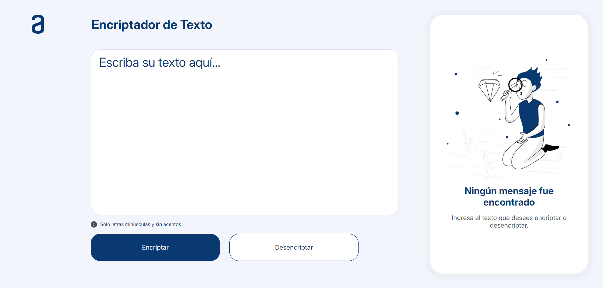

# 🔐 Text Encryptor & Decryptor

## 🚀 Project Description

Welcome to the Text Encryptor & Decryptor! This project allows you to securely encrypt and decrypt messages, ensuring that your confidential information remains protected.

## Project Status

<p align="left">

</p>

## 🛠️ Functionalities

The Text Encryptor & Decryptor offers the following core functionalities:

:heavy_check_mark: `Text Encryption:`
- Convert plain text into an encrypted format using a custom algorithm.
- Ensures that your sensitive information is transformed into an unreadable format to prevent unauthorized access.

:heavy_check_mark: `Text Decryption:`
- Revert encrypted text back to its original readable format.
- Only users with access to the decryption method can retrieve the original message.

:heavy_check_mark: `Copy to Clipboard`
- Easily copy the encrypted or decrypted text with a single click.
- Saves time by eliminating the need to manually select and copy the text.

## 🛠️ Technologies Used

- `Figma:` Implementing a designed user interface with cohesive visual experience.
- `HTML:` Structuring the content of the web page.
- `CSS:` Styling the interface to ensure a visually appealing and consistent design.
- `JavaScript:` Adding dynamic functionality to handle encryption and decryption processes.

## 🚀 Getting Started

To run the project locally, follow these steps:

1. **Clone the repository:**

```bash
git clone https://github.com/jessicaori/Encriptador-de-Texto.git
```

2. **Open the index.html file in your preferred web browser.**

## 📷 Screenshots

**Desktop View:**



**Tablet View:**


**Mobile View:**


## 🧩 How It Works

1. **Input your text:** Enter the text you want to encrypt or decrypt.

2. **Click the desired action:** Choose either "Encrypt" or "Decrypt" to transform your text.


3. **Copy the result:** The transformed text will be displayed for you to copy and use as needed.

## 💻 

**Developer:**

jessica Orihuela Rojas

## 📬 Contact

For any questions or suggestions, reach out to [jessica.orihuela.rojas@gmail.com](maito:jessica.orihuela.rojas@gmail.com)